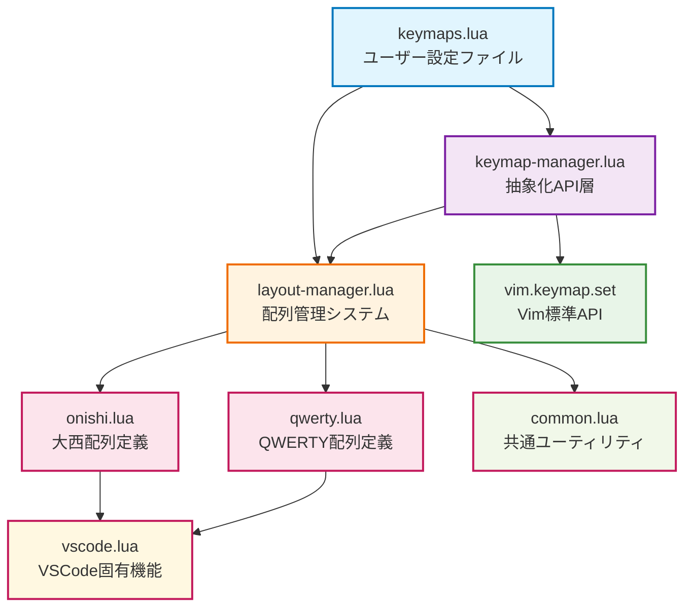

# Neovim キーマップシステム

このドキュメントは、Neovimキーマップシステムの内部設計と高度なカスタマイズ方法について説明します。

## システム概要

このdotfilesのキーマップシステムは、複数の配列（大西配列、QWERTY配列）に対応し、論理的なキー名によってキーマップを定義できる抽象化レイヤーを提供します。

### 設計目標

1. **配列非依存**: ユーザーはQWERTY基準で考えてキーマップを定義
2. **動的切り替え**: 実行時に配列を切り替え可能
3. **VSCode統合**: VSCode Neovim拡張との完全な互換性
4. **拡張性**: 新しい配列やキーマップパターンを容易に追加可能

## アーキテクチャ

### 依存関係図



### レイヤー構成

1. **ユーザー層** (`keymaps.lua`)
   - ユーザーが直接編集する設定ファイル
   - 論理キー名（up/down/left/right）でキーマップを定義

2. **抽象化層** (`keymap-manager.lua`)
   - 論理キー名を実際のキーに変換
   - 統一されたAPIを提供
   - ユーザーから内部実装を隠蔽

3. **システム層** (`layout-manager.lua`)
   - 配列切り替えとコマンド管理
   - 現在の配列状態を追跡
   - 配列固有の論理キーマッピングを提供

4. **設定層** (各配列定義ファイル)
   - 配列固有のキーマップ定義
   - VSCode固有の処理
   - 共通ユーティリティ関数

5. **Vim層** (`vim.keymap.set`)
   - Vimの標準キーマップAPI
   - 最終的なキーマップの実装

## ファイル詳細

### keymap-manager.lua

論理キーマッピングのためのAPIを提供します。

#### 主要関数

```lua
-- 基本的な論理キーマッピング
km.map(logical_key, target, opts)

-- モード指定可能なマッピング
km.map_mode(modes, logical_key, target, opts)

-- リーダーキーマッピング
km.map_leader(key, target, opts)
km.map_local_leader(key, target, opts)

-- 一括マッピング
km.map_bulk(mappings, opts)
```

#### 論理キー対応表

| 論理キー | 大西配列 | QWERTY配列 |
|---------|---------|-----------|
| `up` | n | k |
| `down` | t | j |
| `left` | k | h |
| `right` | s | l |

### layout-manager.lua

配列管理とコマンド登録を担当します。

#### 提供コマンド

```vim
:ToggleKeymap    " 配列をトグル
:KeymapOnishi    " 大西配列に設定
:KeymapQwerty    " QWERTY配列に設定
:KeymapStatus    " 現在の配列状態を表示
```

#### 状態管理

- 現在の配列は `vim.g.keymap_layout` に保存
- 起動時に前回の設定を復元
- 配列切り替え時に既存のキーマップをクリア

### 配列定義ファイル (onishi.lua, qwerty.lua)

各配列固有のキーマップ定義を含みます。

#### 構造

```lua
local config = {
  -- NeovimとVSCode共通の基本マッピング
  normal = {
    ['n'] = 'up',
    ['t'] = 'down',
    -- ...
  },
  
  -- VSCode固有のマッピング
  vscode_normal = {
    ['n'] = 'up',
    ['t'] = 'down',
    -- ...
  },
  
  -- Neovim固有のマッピング
  neovim_basic = {
    ['n'] = 'k',
    ['t'] = 'j',
    -- ...
  },
  
  -- 交換マッピング（元のキーも同時に設定）
  neovim_swap = {
    ['k'] = 'n',  -- k -> n, n -> k
    -- ...
  }
}

return {
  setup = function()
    vscode.setup_keymaps(config)
    common.setup_neovim_keymaps(config)
  end,
  clear = function()
    -- キーマップ削除処理
  end
}
```

### common.lua

共通ユーティリティ関数を提供します。

#### 主要関数

```lua
-- VSCode環境判定
M.is_vscode

-- キーマップ安全削除
M.clear_keymaps(keys)

-- Neovim環境での基本マッピング設定
M.setup_neovim_keymaps(keymap_config)
```

### vscode.lua

VSCode Neovim拡張固有の処理を担当します。

## 新しい配列の追加

### 1. 配列定義ファイルの作成

```lua
-- dvorak.lua
local common = require('config.keymaps.common')
local vscode = require('config.keymaps.vscode')

local dvorak_config = {
  normal = {
    -- Dvorak配列での基本マッピング
  },
  vscode_normal = {
    -- VSCode固有マッピング
  },
  neovim_basic = {
    -- Neovim基本マッピング
  },
  neovim_swap = {
    -- 交換マッピング
  }
}

return {
  setup = function()
    vscode.setup_keymaps(dvorak_config)
    common.setup_neovim_keymaps(dvorak_config)
  end,
  clear = function()
    local keys_to_clear = {
      -- クリアするキーのリスト
    }
    common.clear_keymaps(keys_to_clear)
  end
}
```

### 2. layout-manager.luaの更新

```lua
-- 配列のrequire追加
local dvorak = require('config.keymaps.dvorak')

-- 論理キーマッピング定義に追加
local key_mappings = {
  dvorak = { 
    up = ',', 
    down = 'o',
    left = 'a',
    right = 'e'
  },
  -- ...
}

-- switch_layout関数にケース追加
elseif layout == 'dvorak' then
  dvorak.setup()
  current_layout = 'dvorak'
  vim.g.keymap_layout = 'dvorak'
```

### 3. コマンドの追加

```lua
vim.api.nvim_create_user_command('KeymapDvorak', function()
  switch_layout('dvorak')
end, {
  desc = 'キーマップをDvorak配列に設定'
})
```

## 高度なカスタマイズ

### カスタム論理キーの追加

新しい論理キー（例：`word_left`, `word_right`）を追加する場合：

```lua
-- layout-manager.luaで論理キーマッピングを拡張
local key_mappings = {
  onishi = { 
    -- 既存のマッピング
    word_left = 'b',
    word_right = 'w'
  }
}

-- keymap-manager.luaで使用
km.map('word_left', 'B', { desc = 'Move to previous word' })
km.map('word_right', 'W', { desc = 'Move to next word' })
```

### 条件付きキーマップ

```lua
-- 特定のファイルタイプでのみ有効なキーマップ
vim.api.nvim_create_autocmd('FileType', {
  pattern = 'lua',
  callback = function()
    km.map_local_leader('r', ':luafile %<CR>', { 
      desc = 'Run current Lua file',
      buffer = true 
    })
  end,
})
```

### 動的キーマップ

```lua
-- プラグインの状態に応じたキーマップ
local function toggle_diagnostic()
  if vim.diagnostic.is_disabled() then
    vim.diagnostic.enable()
    km.map_leader('d', vim.diagnostic.open_float, { desc = 'Show diagnostics' })
  else
    vim.diagnostic.disable()
    vim.keymap.del('n', '<leader>d')
  end
end
```

## トラブルシューティング

### よくある問題

1. **キーマップが効かない**
   - 現在の配列設定を確認: `:KeymapStatus`
   - 競合するキーマップがないか確認: `:map {key}`

2. **配列切り替えがうまくいかない**
   - `vim.g.keymap_layout` の値を確認
   - 手動で初期化: `require('config.keymaps.layout-manager').init()`

3. **VSCodeで動作しない**
   - `vim.g.vscode` が正しく設定されているか確認
   - VSCode固有のマッピングが定義されているか確認

### デバッグ方法

```lua
-- 現在のキーマップを確認
print(vim.inspect(vim.api.nvim_get_keymap('n')))

-- 論理キーの実際のマッピングを確認
local km = require('config.keymaps.keymap-manager')
print(km.get_current_layout())
print(vim.inspect(km.get_available_keys()))
```

## パフォーマンス考慮事項

- キーマップの切り替えは既存のマッピングを削除してから新しいものを設定
- 起動時の初期化は1回のみ実行
- 論理キーの解決はキーマップ設定時に実行（実行時ではない）

## 将来の拡張計画

- 複数の論理キーセットのサポート
- キーマップのインポート/エクスポート機能
- GUIでの配列切り替えインターフェース
- キーマップの使用統計とヒートマップ